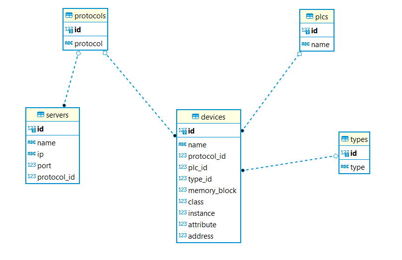

README.md

## Revision History

| Date       | Description | Revisor Name            | Verion |
| ---------- | ----------- | ----------------------- | ------ |
| 05/04/2023 | Inicial     | José Carlos de Oliveira | 0.1    |

## Introduction

This is the server for the project ISI 4.0 from ICTS.
This code was developed in GoLang and provides a database containing all the basic elements that configures all servers, PLCs and 
devices connected to the solution, and the HTTP endpoints needed for the CRUD operations on the database.
When executed, if the database is not found (on the possible first execution) it is automatically created and populated with 
initial mocked values.
Currently the database was implemented using SQLite, but, can easily changed to another database solution, like Postgresql
or MySql and its variants (MariaDB, etc.), among others.

## DataBase ER Diagram

Below we can see the ER Diagram of the database:



Note that this is a work in progress, and certainly changes will occurs before the project cames to production state.

## Tools

### GoLang

This tool is a GoLang compiler

* [[Download and install - The Go Programming Language](https://go.dev/doc/install)](https://dbeaver.io/download/)
* Install according with your Operational System.
* Setup.

### Visual Studio Code

This tool is a IDE used to easly edit and view source codes wer recomend to use more resent version

* ([Download Visual Studio Code - Mac, Linux, Windows](https://code.visualstudio.com/download))
* Install according with your Operational System.
* Open Visual Studio Code and go to your project folter and wait to download all dependencies

### Swagger

This Tool allows you to describe the structure of your APIs so that machines can read them. The ability of APIs to describe their 
own structure is the root of all awesomeness in Swagger. Why is it so great? Well, by reading your API’s structure, we can automatically build beautiful and interactive API documentation. We can also automatically generate client libraries for your API 
in many languages and explore other possibilities like automated testing. Swagger does this by asking your API to return a YAML
or JSON that contains a detailed description of your entire API. This file is essentially a resource listing of your API which adheres
to OpenAPI Specification. The specification asks you to include information like:

* What are all the operations that your API supports?
* What are your API’s parameters and what does it return?
* Does your API need some authorization?

And even fun things like terms, contact information and license to use the API.
This application uses Swagger to interface with the several endpoints defined for the server.
Whenever endpoints are added or modified `swag init` must be executed on the root folder of the project, in order to update all 
the Swagger definitions.

### DBeaver

This Tool is used to view many DataBases including SQLite used on it version.

* [Download &#124; DBeaver Community](https://dbeaver.io/download/)
* Install according with your Operational System.
* Setup to access your Using DataBase.

## Checkout project from git repository

Open a Windows Command prompt or Linux Terminal and performs the bellow commands:

```
$ mkdir <your-workspace>
$ cd <your-workspace>
$ git clone https://git.grupoicts.com.br/finep-isi/backend.git
$ cd backend
$ git pull
```

## Creating your own branch

```
$ git checkout -b <nome-nova-branch> <nome-branch-remota>
$ git push --set-upstream origin <nome-nova-branch>
```

## Changing branch

```
$ git branch
$ git checkout <nome-branch-remota>
$ git pull
$ git branch
```

## Updating your local branch

```
$ git pull
```

## Saving your local branch on repository

```
$ git pull
$ git add .
$ git commit -m"yur message"
$ git push
```

## Building

```
$ cd gwisi40server
$ go build
```

## Preparing to Run backend on Windows
Before you run the backend, performs the following actions:
```
cd <your-workspace>\frontend\isi_4_0
flutter build web
xcopy build\web  ..\..\backend\gwisi40server\web /E /I
```

## Running backend on Windows
Run the backend and open browser with URL >  127.0.0.1:8585
```
cd <your-workspace>\backend\gwisi40server
$ go build
$ gwisi40server.exe
     AAAA/MM/DD HH:MM:SS Starting API
     AAAA/MM/DD HH:MM:SS OS: Windows_NT
     AAAA/MM/DD HH:MM:SS Opening connection to database
     AAAA/MM/DD HH:MM:SS Migrating database tables
     AAAA/MM/DD HH:MM:SS Server started in port 8585
```

## Preparing to Run backend on Linux
Before you run the backend, performs the following actions:
```
cd <your-workspace>/frontend/isi_4_0
flutter build web
cp -r build/web  ../../backend/gwisi40server
```

## Running backend on Linux
Running back and and open browser witn URL >  127.0.0.1:8585
```
cd <your-workspace>/backend/gwisi40server
$ go build
$ ./gwisi40server
     AAAA/MM/DD HH:MM:SS Starting API
     AAAA/MM/DD HH:MM:SS OS: Windows_NT
     AAAA/MM/DD HH:MM:SS Opening connection to database
     AAAA/MM/DD HH:MM:SS Migrating database tables
     AAAA/MM/DD HH:MM:SS Server started in port 8585
```
